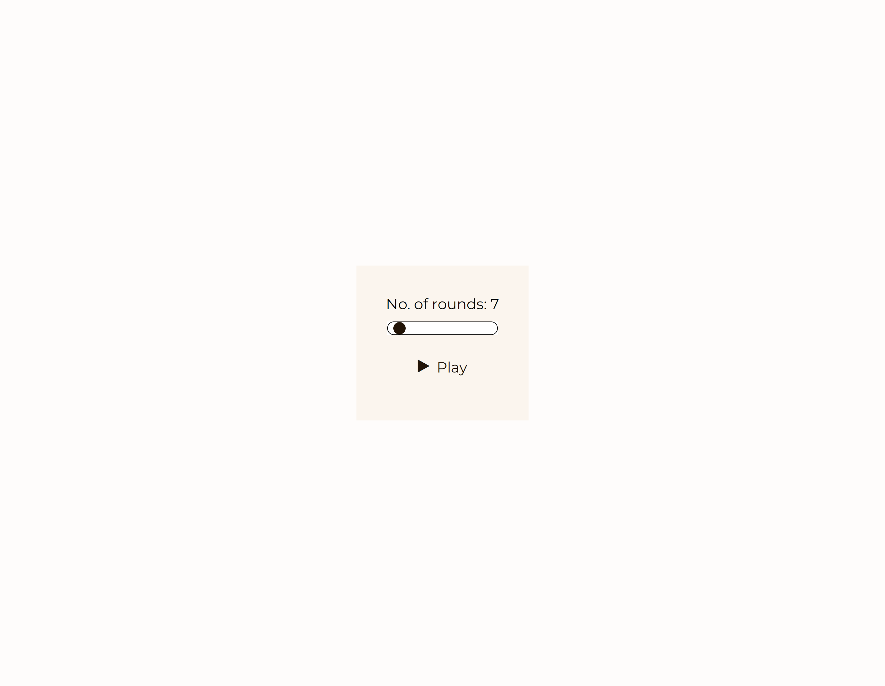

# Personal Project - Rock Paper Scissor game

- This is a personal project undertaken to enhance and get hands-on practice with JavaScript.
- This project is based on "Rock, Paper and Scissor" game wherein computer generates random choices and we have to counteract and win.
- The project offers intuitive and simple user interface for the best experience.

## Table of contents

- [Overview](#overview)
  - [The challenge](#the-challenge)
  - [Screenshot](#screenshot)
  - [Links](#links)
- [My process](#my-process)
  - [Built with](#built-with)
  - [What I learned](#what-i-learned)
  - [Continued development](#continued-development)
- [Acknowledgments](#acknowledgments)

## Overview

### The challenge

Users should be able to:

- choose number of rounds to play ranging from 1 to 99 (1 is the default choice)
- track current number of round and total rounds
- be able to choose a weapon between 'rock', 'paper' and 'scissor' to have a chance to win the round
- know the round result after choosing weapon
- track total wins and losses until current round
- know the weapon chosen by you and computer within round
- know the final result after completing game
  - The game details will be shown in result page (rounds won, lost, tied and total rounds played)

### Screenshot

Welcome Page - This shows the starting page of the website wherein you can choose the number of rounds to play


Game Play Stage - This is the section where you interact with components and play the game


Results Page - This is the section where you will see the results of how well you played and the statistics of the entire session


### Links

- Solution URL: [Repository link](https://github.com/kushagarwal11ag/rock-paper-scissor)
- Live Site URL: [Website link](https://kushagarwal11ag.github.io/rock-paper-scissor/)

## My process

### Built with

- Semantic HTML5 markup
- CSS custom properties
- Flexbox
- Mobile-first workflow
- JavaScript

### What I learned

- Better understanding of JavaScript, its event listeners, DOM Manipulation, etc.
- It was a fun project which took some time due to making it have a better UI and UX experience.

In CSS, learned to better style the range slider of input type. This code changes color of the track of the slider.
```css
input[type="range"]::-webkit-slider-runnable-track {
	border-radius: 25px;
	border: 1px solid black;
}
```

In JavaScript, learned use of break function which prevented additional code, here it is responsible for not letting function work until condition is met. 
```js
function nextRoundFn() {
	noNextRound: if (value === 0) {
		break noNextRound;
	} else if (roundsPlayed < no_of_rounds) {
		//additional code
  }
}
```

### Continued development

- Better and compact use of code such that it does not take 10 lines of code which can be done simply with 1 - 2 lines.
- Better UI and UX experience such that it would be fun just to browse the project if not interact with it.

## Acknowledgments

Credits to [Ania Kubow](https://www.youtube.com/@AniaKubow) for inspiring me to undertake this simple project to better my JavaScript skills.
